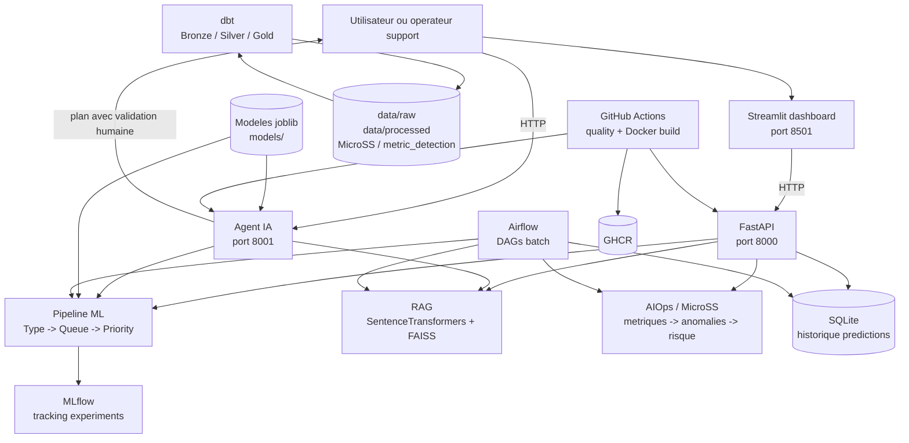
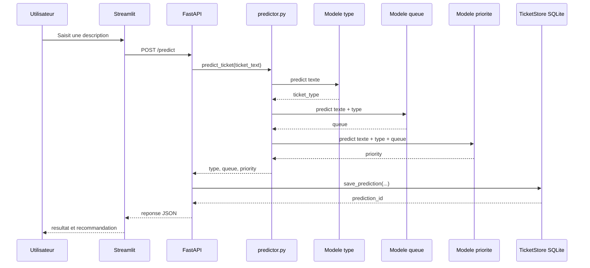
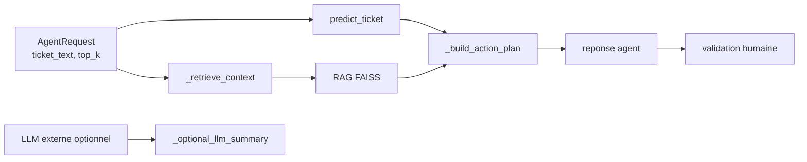
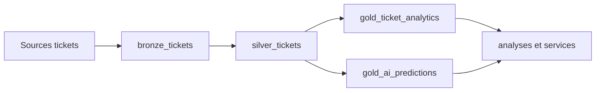
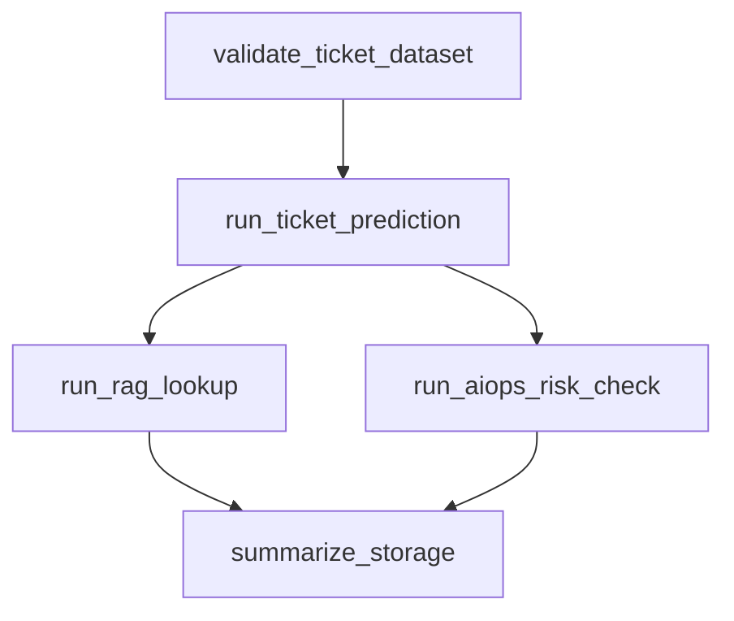
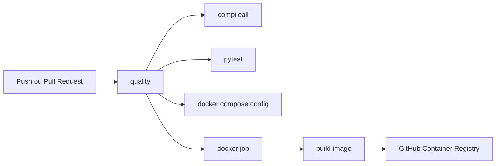

# HARDTEC Intelligent Support & AIOps

## Architecture complete du projet

**Entreprise :** HARDTEC MAROC  
**Site officiel :** https://hardtec.net  
**Projet :** plateforme intelligente de support IT, prediction des incidents et agent IA  
**Version decrit dans ce document :** etat present du depot  
**Document genere le :** 15 septembre 2026

---

## 1. Objet du systeme

HARDTEC Intelligent Support & AIOps rapproche deux domaines qui sont souvent traites separement :

1. le support utilisateur et la classification des demandes ;
2. l'observabilite technique et la prediction du risque d'incident.

La plateforme permet de :

- classer automatiquement un ticket selon son type ;
- predire sa file d'affectation ;
- estimer sa priorite ;
- conserver les predictions dans SQLite ;
- retrouver des tickets historiques similaires avec un moteur RAG ;
- analyser des signaux AIOps et MicroSS ;
- construire des resumes de risque d'incident ;
- assister l'operateur avec un agent IA ;
- suivre les experiences ML avec MLflow ;
- orchestrer des traitements batch avec Airflow ;
- transformer les donnees avec dbt ;
- deployer les services avec Docker ;
- executer des controles automatiques avec GitHub Actions.

L'agent IA est un agent d'aide a la decision. Il ne declenche pas automatiquement une action irreversible et exige une validation humaine.

---

## 2. Vue d'ensemble de l'architecture



### 2.1 Couches logiques

| Couche | Responsabilite | Composants principaux |
|---|---|---|
| Presentation | Saisie et consultation | `streamlit/app.py` |
| Services temps reel | API REST et orchestration IA | `src/api/main.py`, `src/agent/main.py` |
| Intelligence ticket | Type, file et priorite | `src/pipeline/predictor.py`, `src/ml/` |
| Intelligence contextuelle | Recherche de cas similaires | `src/rag/rag_engine.py`, `models/rag/` |
| AIOps | Anomalies et risque incident | `src/aiops/`, `MicroSS/`, `metric_detection/` |
| Persistance | Historique des predictions | `src/data/ticket_store.py`, `data/lake/` |
| Donnees analytiques | Transformation et modeles SQL | `dbt/hardtec_dbt/` |
| Orchestration | Execution batch planifiee | `airflow/dags/` |
| MLOps | Runs, metriques, artefacts | MLflow, `src/ml/tracking.py`, `mlflow.db`, `mlruns/` |
| Deploiement | Conteneurs et services | `Docker/`, scripts de deploiement |
| Integration continue | Compilation, tests et publication | `.github/workflows/ci-cd.yml` |

---

## 3. Arborescence fonctionnelle du depot

Les elements techniques sont regroupes par responsabilite. Les caches, fichiers temporaires et environnements virtuels ne sont pas des composants fonctionnels.

```text
hardtec-intelligent-ticketing/
|
|-- src/
|   |-- api/
|   |   |-- main.py                  API FastAPI active
|   |   `-- main_backup.py           ancienne variante / sauvegarde
|   |-- agent/
|   |   `-- main.py                  service agent IA
|   |-- pipeline/
|   |   |-- predictor.py             orchestration inference ticket
|   |   `-- ticket_classifier.py      ancienne logique/classifieur
|   |-- data/
|   |   |-- preprocess.py            preparation des tickets
|   |   |-- ticket_store.py          persistance SQLite
|   |   `-- load_to_snowflake.py     chargement Snowflake optionnel
|   |-- ml/
|   |   |-- train_*.py               entrainement et variantes ML
|   |   |-- predict_*.py             essais d'inference specialises
|   |   |-- evaluate_*.py            evaluations et benchmarks
|   |   |-- analyze_*.py             audits de labels et d'erreurs
|   |   |-- compare_queue_models.py  comparaison des modeles de file
|   |   `-- tracking.py              utilitaires MLflow
|   |-- rag/
|   |   |-- rag_engine.py            retrieval FAISS
|   |   |-- build_index.py           construction index/document store
|   |   `-- test_rag.py              test du RAG
|   |-- aiops/
|   |   |-- detect_*.py              detection d'anomalies
|   |   |-- build_*.py               fenetres, incidents et agregations
|   |   |-- predict_*.py             prediction du risque
|   |   |-- metrics/                 detecteurs de metriques GAIA
|   |   |-- correlation/             correlation logs/metrics/incidents
|   |   `-- micross/                 pipeline MicroSS multi-source
|   `-- config.py                    environnement et Snowflake
|
|-- streamlit/
|   |-- app.py                       interface utilisateur
|   |-- queries.py                   lectures analytiques
|   `-- snowflake_connection.py      acces Snowflake optionnel
|
|-- data/
|   |-- raw/                         donnees sources
|   |-- processed/                   sorties nettoyees, ML et AIOps
|   `-- lake/                        SQLite et donnees locales
|
|-- models/
|   |-- ticket_type_model.pkl        modele de type
|   |-- ticket_queue_model_v4.pkl    modele de file
|   |-- ticket_priority_model_v3.pkl modele de priorite
|   |-- rag/                         index FAISS et documents
|   |-- micross/                     modeles et metadonnees AIOps
|   `-- ...                          autres artefacts de recherche
|
|-- airflow/
|   |-- dags/                        pipelines planifies
|   |-- Dockerfile
|   `-- docker-compose.yml
|
|-- dbt/hardtec_dbt/
|   |-- models/bronze/
|   |-- models/silver/
|   |-- models/gold/
|   |-- models/schema.yml
|   `-- dbt_project.yml
|
|-- Docker/
|   |-- Dockerfile
|   |-- docker-compose.yml           stack API + agent + MLflow
|   `-- README.md
|
|-- tests/                           tests unitaires et API
|-- .github/workflows/ci-cd.yml      pipeline CI/CD
|-- requirements.txt                 dependances Python
|-- .env.example                     variables d'environnement
|-- deploy.ps1 / deploy.sh           commandes de deploiement
|-- MLFLOW.md                        instructions de tracking
`-- rapport_pfa/main.tex             rapport LaTeX
```

---

## 4. Flux de traitement d'un ticket

### 4.1 Prediction temps reel



### 4.2 Contrat de prediction

`src/pipeline/predictor.py` charge trois artefacts joblib :

- `models/ticket_type_model.pkl` ;
- `models/ticket_queue_model_v4.pkl` ;
- `models/ticket_priority_model_v3.pkl`.

L'ordre effectivement implemente est :

```text
texte du ticket
    -> type
    -> queue a partir du texte + type
    -> priorite a partir du texte + type + queue
```

La fonction retourne actuellement :

```json
{
  "ticket_type": "...",
  "priority": "...",
  "queue": "..."
}
```

La couche API ajoute une recommandation, un identifiant de prediction et un statut de sauvegarde. Le champ `confidence` est gere par l'API avec une valeur par defaut lorsque le predictord ne le fournit pas.

### 4.3 Endpoints FastAPI

Le point d'entree actif est `src/api/main.py` et l'application est `app`.

| Endpoint | Methode | Role |
|---|---:|---|
| `/` | GET | etat general et disponibilite des services |
| `/health` | GET | diagnostic API, ML, AIOps, RAG et base |
| `/predict` | POST | classification, routage, priorite et persistance |
| `/aiops/predict-risk` | POST | prediction MicroSS pour un timestamp |
| `/rag/search` | POST | recherche de tickets historiques similaires |
| `/support/analyze` | POST | analyse combinee ML + RAG + AIOps optionnel |
| `/history` | GET | predictions recentes depuis SQLite |
| `/stats` | GET | statistiques historiques |

Les schemas d'entree sont definis avec Pydantic : `TicketRequest`, `AIOpsRiskRequest`, `RAGSearchRequest` et `SupportAnalyzeRequest`.

---

## 5. Agent IA

Le service est defini dans `src/agent/main.py` et demarre avec une seconde application FastAPI.

### 5.1 Flux de l'agent



### 5.2 Endpoint agent

| Endpoint | Methode | Role |
|---|---:|---|
| `/health` | GET | etat du service, disponibilite RAG et configuration LLM |
| `/agent/analyze` | POST | analyse complete et plan d'action |

Exemple de requete :

```json
{
  "ticket_text": "Le VPN est indisponible pour plusieurs utilisateurs",
  "top_k": 3,
  "allow_external_llm": false
}
```

La reponse comprend :

- le texte original ;
- la prediction ML ;
- les tickets similaires ;
- les actions recommandees ;
- un resume local ou LLM optionnel ;
- `human_approval_required: true`.

Le LLM externe est desactive par defaut et ne peut etre utilise que si `AGENT_LLM_URL` et `AGENT_LLM_API_KEY` sont definies.

---

## 6. Recherche RAG

Le moteur est defini dans `src/rag/rag_engine.py`.

### 6.1 Artefacts

```text
models/rag/tickets.index       index FAISS
models/rag/documents.pkl       documents historiques
```

Le modele d'embedding configure est :

```text
sentence-transformers/paraphrase-multilingual-MiniLM-L12-v2
```

### 6.2 Traitement

1. la requete est validee ;
2. le modele SentenceTransformer genere un vecteur ;
3. FAISS recherche les voisins les plus proches ;
4. les documents sont recuperes depuis `documents.pkl` ;
5. le score, le document et l'index sont retournes ;
6. l'API parse les metadonnees textuelles lorsque disponibles.

Le RAG est charge de maniere tolerante dans l'API et l'agent : si FAISS, SentenceTransformers ou les artefacts ne sont pas disponibles, le service peut signaler un etat degrade.

---

## 7. AIOps et MicroSS

### 7.1 Role

La couche AIOps observe des series temporelles et des signaux d'exploitation afin de detecter des anomalies, construire des incidents et produire un risque futur. Elle complete le support : un ticket peut etre analyse avec le contexte technique de l'infrastructure.

### 7.2 Sous-systemes

| Sous-systeme | Chemin | Responsabilite |
|---|---|---|
| Fenetres AIOps | `src/aiops/build_aiops_windows.py` | construction de fenetres temporelles |
| Anomalies | `src/aiops/detect_anomalies.py` | detection sur les fenetres |
| Incidents | `src/aiops/build_incidents.py`, `build_gaia_incidents.py` | regroupement et correlation |
| Risque incident | `src/aiops/predict_incidents.py`, `predict_incident_risk.py` | prediction du risque |
| GAIA temporel | `src/aiops/detect_gaia_temporal_anomalies.py` | anomalies temporelles GAIA |
| GAIA logs | `src/aiops/train_gaia_log_semantic_detector.py` | detection semantique de logs |
| GAIA metriques | `src/aiops/metrics/` | modeles de metriques et variantes |
| Correlation | `src/aiops/correlation/` | liaison logs, metriques et incidents |
| MicroSS | `src/aiops/micross/` | features multi-sources et risque MicroSS |

### 7.3 Donnees et sorties

Les donnees d'entree sont notamment stockees dans :

```text
MicroSS/metric_selected/
MicroSS/metric_candidates/
metric_detection/
logs/
log/
data/raw/
```

Les sorties fonctionnelles sont notamment :

```text
data/processed/aiops_windows.csv
data/processed/aiops_anomalies.csv
data/processed/aiops_incidents.csv
data/processed/aiops_incident_risk.csv
data/processed/aiops_incident_predictions.csv
data/processed/gaia_temporal_anomalies.csv
data/processed/gaia_incidents.csv
```

### 7.4 Prediction AIOps dans l'API

`POST /aiops/predict-risk` recoit un timestamp et utilise `MicroSSRiskPredictor`.  
`POST /support/analyze` peut appeler le meme predictor si `micross_timestamp` est fourni.

---

## 8. Persistance locale

`src/data/ticket_store.py` gere SQLite et cree automatiquement :

```text
data/lake/tickets_predictions.db
```

### 8.1 Table `ticket_predictions`

| Colonne | Type | Role |
|---|---|---|
| `id` | INTEGER | cle primaire auto-incrementee |
| `ticket_text` | TEXT | description originale |
| `ticket_type` | TEXT | type predit |
| `priority` | TEXT | priorite predite |
| `queue` | TEXT | file predite |
| `confidence` | REAL | score conserve par l'API |
| `recommendation` | TEXT | recommandation utilisateur |
| `created_at` | TIMESTAMP | date de creation |
| `source` | TEXT | API, dashboard ou Airflow |

Un index est cree sur `created_at` pour accelerer l'historique recent.

---

## 9. Preparation et entrainement ML

### 9.1 Preparation

`src/data/preprocess.py` prepare les donnees de tickets et produit notamment le dataset nettoye utilise par les modeles. Les donnees traitees sont conservees dans `data/processed/`.

### 9.2 Entrainement

Les scripts principaux sont :

- `src/ml/train_type_classifier.py` ;
- `src/ml/train_queue_classifier_v4.py` ;
- `src/ml/train_queue_classifier_v5.py` ;
- `src/ml/train_priority_classifier_v3.py` ;
- `src/ml/train_queue_embeddings_xgb.py` ;
- `src/ml/train_queue_distilbert.py`.

Les scripts d'analyse et d'evaluation comprennent notamment :

- `evaluate_pipeline.py` ;
- `benchmark_datasets.py` ;
- `compare_queue_models.py` ;
- `forensic_evaluate_queue_v4.py` ;
- `analyze_queue_labels.py` ;
- `analyze_queue_errors_v4.py` ;
- `audit_queue_separability.py` ;
- `queue_label_quality_report.py` ;
- `analyze_type_to_queue_impact.py`.

### 9.3 Tracking MLflow

Les scripts d'entrainement utilisent l'experience `hardtec-ticketing`. Le depot contient :

```text
mlflow.db
mlruns/
MLFLOW.md
src/ml/tracking.py
```

Les informations suivies peuvent inclure le hash et la taille du dataset, les hyperparametres, les metriques et les artefacts du modele.

---

## 10. Pipeline de donnees dbt

Le projet dbt se trouve dans `dbt/hardtec_dbt/`.



### 10.1 Modeles

| Couche | Fichier | Responsabilite |
|---|---|---|
| Bronze | `models/bronze/bronze_tickets.sql` | copie et preparation des tickets sources |
| Silver | `models/silver/silver_tickets.sql` | nettoyage, identifiant et texte combine |
| Gold | `models/gold/gold_ticket_analytics.sql` | agregations analytiques |
| Gold | `models/gold/gold_ai_predictions.sql` | classifications generees par l'IA |
| Contrats | `models/schema.yml` | descriptions, `not_null` et `accepted_values` |

La configuration du projet est dans `dbt_project.yml`. Les tests declaratifs du schema couvrent notamment le type, la priorite, la queue, le texte ticket, l'identifiant et la date de creation.

---

## 11. Orchestration Airflow

Les DAGs sont dans `airflow/dags/`.

### 11.1 DAG complet

`hardtec_complete_pipeline.py` execute :



Il verifie `data/processed/tickets_clean.csv`, execute une prediction, lance une recherche RAG, teste le risque MicroSS et verifie le nombre de lignes SQLite.

### 11.2 DAG AIOps

`hardtec_aiops_pipeline.py` execute :

```text
check_aiops_inputs
    -> generate_aiops_risk_summary
    -> summarize_aiops_risk
```

Il verifie `aiops_anomalies.csv` et `aiops_incidents.csv`, lance `src/aiops/predict_incident_risk.py` puis verifie `aiops_incident_risk.csv`.

### 11.3 Autres DAGs

- `hardtec_ticket_pipeline.py` : validation et prediction de tickets ;
- `hardtec_rag_pipeline.py` : preparation ou verification du pipeline RAG ;
- `hardtec_complete_pipeline.py` : scenario de bout en bout.

Airflow orchestre les traitements batch. Il ne remplace pas les endpoints FastAPI temps reel.

---

## 12. Interface Streamlit

Le point d'entree est `streamlit/app.py`.

Fonctions principales :

- saisie d'une description de ticket ;
- appel HTTP vers `FASTAPI_URL` ;
- affichage des predictions ;
- consultation de l'historique ;
- affichage de statistiques et graphiques ;
- consultation de contexte RAG ;
- affichage d'informations AIOps.

Les modules auxiliaires sont :

- `streamlit/queries.py` pour les requetes locales ;
- `streamlit/snowflake_connection.py` pour l'acces Snowflake optionnel.

---

## 13. Deploiement Docker

### 13.1 Stack active

`Docker/docker-compose.yml` definit trois services :

| Service | Port | Commande | Donnees montees |
|---|---:|---|---|
| `api` | 8000 | `uvicorn src.api.main:app` | modeles en lecture seule, data en lecture/ecriture |
| `agent` | 8001 | `uvicorn src.agent.main:app` | modeles et data |
| `mlflow` | 5000 | `mlflow server` | volume `mlflow_data` |

L'agent depend du healthcheck de l'API. Les healthchecks interrogent `/health` sur les deux services applicatifs.

### 13.2 Image

`Docker/Dockerfile` :

1. part de `python:3.13-slim` ;
2. configure `PYTHONPATH=/app` ;
3. installe `requirements.txt` ;
4. copie `src`, `models` et `data` ;
5. expose les ports applicatifs ;
6. demarre par defaut FastAPI sur le port 8000.

### 13.3 Commandes

```powershell
# Stack principale
 docker compose -f Docker/docker-compose.yml up --build

# API
 http://localhost:8000
 http://localhost:8000/docs

# Agent
 http://localhost:8001/health

# MLflow
 http://localhost:5000
```

Le depot contient aussi des fichiers Docker a la racine et une stack Airflow separee. Ils correspondent a des modes de deploiement distincts et ne doivent pas etre confondus avec la composition `Docker/docker-compose.yml` de la plateforme applicative.

---

## 14. Configuration et secrets

Les fichiers de configuration sont :

- `.env.example` ;
- `.env` local ;
- `src/config.py` ;
- `streamlit/.env` lorsqu'il est utilise ;
- variables d'environnement Docker Compose.

Variables importantes :

```text
SNOWFLAKE_ACCOUNT
SNOWFLAKE_USER
SNOWFLAKE_PASSWORD
SNOWFLAKE_WAREHOUSE
SNOWFLAKE_DATABASE
SNOWFLAKE_SCHEMA
SNOWFLAKE_ROLE
DATABASE_PATH
FASTAPI_URL
AGENT_LLM_URL
AGENT_LLM_API_KEY
MLFLOW_TRACKING_URI
MLFLOW_EXPERIMENT_NAME
```

`src/config.py` refuse les valeurs absentes ou placeholder pour Snowflake. Les secrets ne doivent pas etre inscrits dans le code ni commites dans Git.

---

## 15. Tests et qualite

Le dossier `tests/` contient actuellement :

- `test_api_endpoints.py` ;
- `test_agent.py` ;
- `test_environment_config.py` ;
- `test_predictor.py` ;
- `test_ticket_store.py`.

Les controles couvrent les endpoints, la configuration, le predictor, le stockage et le healthcheck de l'agent. La CI execute aussi la compilation Python et la validation de Docker Compose.

Commande generale :

```powershell
python -m pytest -q
python -m compileall -q src tests
```

### Etat de validation a retenir

- la syntaxe et les tests cibles peuvent etre executes localement ;
- le build complet depend de l'espace disque disponible et de l'installation des dependances ;
- le RAG depend de FAISS, SentenceTransformers et de ses artefacts ;
- les integrations Snowflake restent optionnelles et necessitent des secrets valides ;
- le demarrage Docker complet doit etre verifie dans un environnement disposant de Docker et d'un espace suffisant.

---

## 16. CI/CD

Le workflow `.github/workflows/ci-cd.yml` contient deux jobs.



### Job `quality`

- checkout ;
- Python 3.13 ;
- cache pip ;
- installation de `requirements.txt` et pytest ;
- compilation de `src` et `tests` ;
- execution de pytest ;
- validation de `Docker/docker-compose.yml`.

### Job `docker`

Le job s'execute apres `quality` sur un push. Il se connecte a GHCR et publie l'image `hardtec-agent:latest`.

---

## 17. Matrice des flux de donnees

| Origine | Transformation | Sortie | Consommateur |
|---|---|---|---|
| tickets bruts | preprocessing | `tickets_clean.csv` | entrainement ML et Airflow |
| tickets nettoyes | TF-IDF + classifieurs | modeles joblib | API et agent |
| tickets historiques | embeddings + FAISS | `tickets.index`, `documents.pkl` | RAG et agent |
| metriques MicroSS | fenetrage et features | sorties AIOps | predictor de risque |
| anomalies/incidents | aggregation | `aiops_incident_risk.csv` | API, Airflow et analyse |
| requete `/predict` | inference | prediction JSON | Streamlit/client |
| prediction API | insertion SQLite | historique | `/history`, `/stats`, dashboard |
| entrainement ML | logging MLflow | runs et artefacts | developpeurs/MLOps |

---

## 18. Modes d'execution

### Mode local API

```powershell
python -m uvicorn src.api.main:app --reload
```

### Mode local agent

```powershell
python -m uvicorn src.agent.main:app --port 8001 --reload
```

### Mode dashboard

```powershell
streamlit run streamlit/app.py
```

### Mode Docker

```powershell
docker compose -f Docker/docker-compose.yml up --build
```

### Mode orchestration

Airflow doit etre lance depuis sa propre composition et utiliser le depot comme espace de travail. Les DAGs resolvent la racine soit par `/workspace`, soit par leur emplacement local.

---

## 19. Decisions d'architecture

### SQLite plutot que MinIO pour le stockage local

La version applicative actuelle utilise SQLite pour l'historique des predictions et un volume Docker pour MLflow. MinIO n'est pas necessaire au lancement de la stack applicative actuelle. Snowflake reste une integration optionnelle pour les donnees et le chargement externe.

### Agent IA comme orchestrateur

L'agent reutilise les capacites existantes de prediction et de recherche. Il ne duplique pas l'entrainement et ne remplace pas FastAPI. Cette separation permet d'activer un LLM externe sans rendre le fonctionnement local dependant d'une API distante.

### Validation humaine

Le plan d'action reste une recommandation. Cette decision limite les risques operationnels lorsqu'un ticket concerne une infrastructure critique.

---

## 20. Limites et points a verifier

Cette architecture est une description de l'etat du depot, pas une declaration de disponibilite production.

1. La dependance `requirements.txt` est large et inclut API, Streamlit, dbt, Snowflake et MLflow dans le meme environnement.
2. L'installation complete peut rencontrer des contraintes d'espace disque.
3. Le RAG n'est disponible que si ses dependances et artefacts existent.
4. Les modeles sont charges depuis des fichiers joblib locaux et ne disposent pas encore d'une strategie de promotion formelle.
5. L'API ne presente pas dans son code actuel de mecanisme complet d'authentification et d'autorisation.
6. Le LLM externe est optionnel et non necessaire au mode local.
7. La composition Docker applicative ne lance pas Streamlit ; le dashboard doit etre lance separement ou ajoute explicitement a une composition future.
8. Airflow et dbt sont des sous-systemes presents dans le depot mais leur execution complete depend de leur environnement propre.
9. Les metrics de performance doivent etre lues dans MLflow ou les fichiers de resultats disponibles, sans inventer de valeurs.
10. Les anciennes variantes de scripts ML et `main_backup.py` sont des artefacts de developpement et ne doivent pas etre presentes comme points d'entree actifs.

---

## 21. Resume executif

```text
Utilisateur
    -> Streamlit ou client HTTP
    -> FastAPI
    -> prediction ML
    -> SQLite

Agent IA
    -> prediction ML
    -> RAG historique
    -> plan d'action
    -> validation humaine

AIOps
    -> MicroSS et series temporelles
    -> fenetres
    -> anomalies
    -> incidents
    -> risque

Industrialisation
    -> MLflow pour les experiences
    -> Airflow pour les traitements batch
    -> dbt pour les modeles analytiques
    -> Docker pour les services
    -> GitHub Actions pour la qualite et le build
```

La plateforme est donc un systeme de support IT augmente par l'IA et l'AIOps, et non un simple classifieur de tickets.
