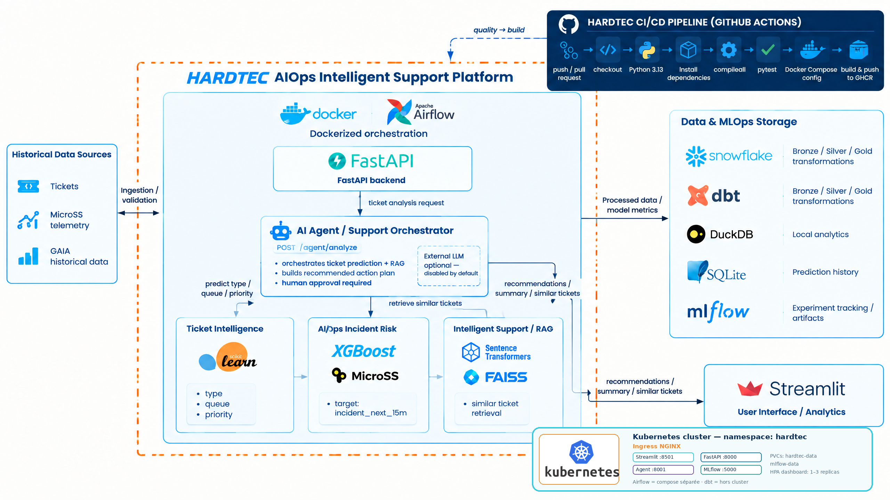
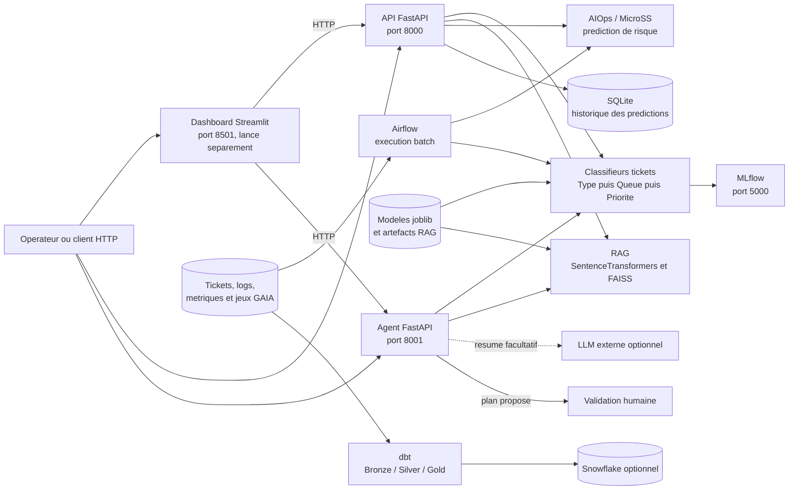
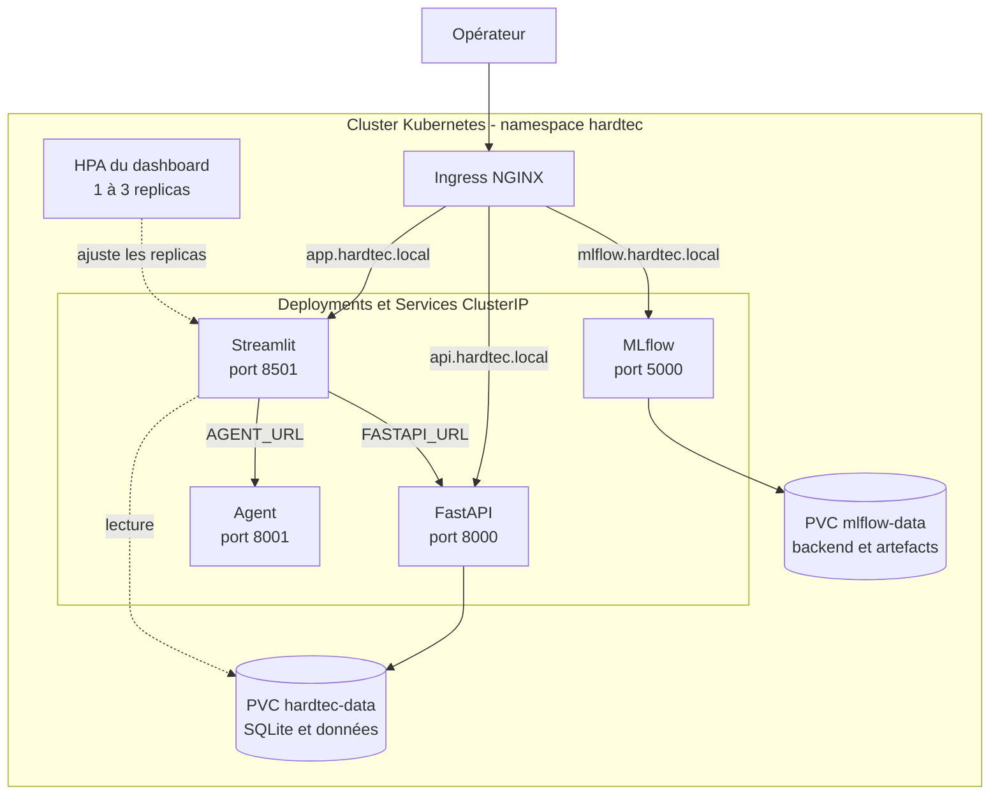
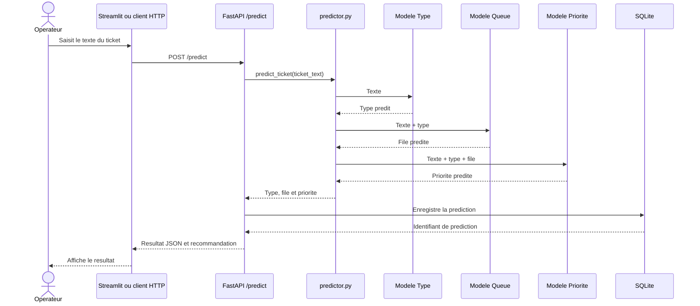
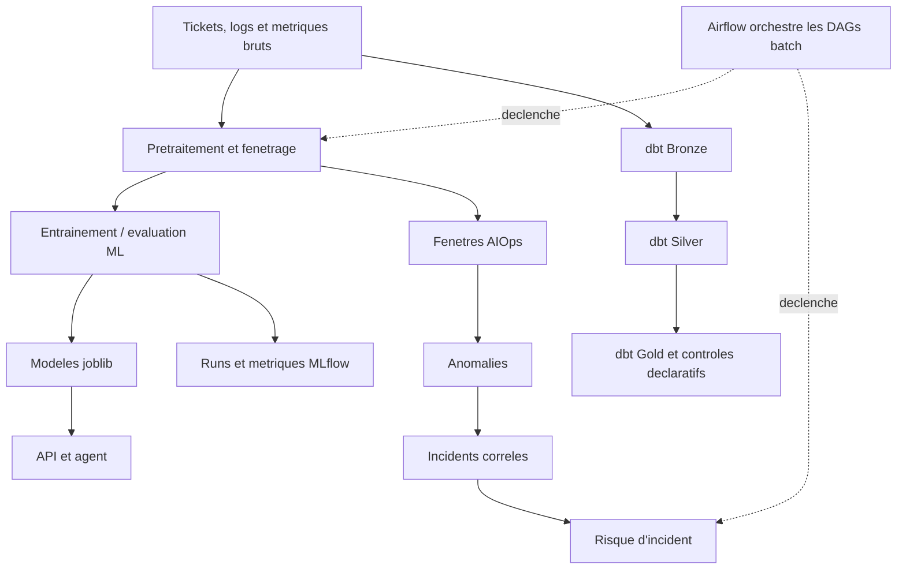

# HARDTEC Intelligent Ticketing & AIOps

Plateforme de support IT augmentee par le machine learning, la recherche de tickets historiques (RAG) et l'analyse AIOps. Elle expose des services HTTP pour classifier les tickets, suggerer des actions et estimer des risques d'incident. Les recommandations de l'agent restent soumises a une validation humaine.

## 🏗️ Architecture


## Capacites

| Domaine | Fonctionnalite | Point d'entree / composants |
| --- | --- | --- |
| Classification de tickets | Prediction du type, de la file et de la priorite | `src/pipeline/predictor.py`, `src/ml/`, `models/` |
| API temps reel | Prediction, recherche RAG, risque AIOps, historique et statistiques | `src/api/main.py` |
| Agent de support | Combine classification, contexte historique et plan d'actions | `src/agent/main.py` |
| Recherche historique | Embeddings multilingues et recherche de voisins avec FAISS | `src/rag/`, `models/rag/` |
| AIOps | Preparation de series temporelles, detection d'anomalies, incidents et risque | `src/aiops/`, `MicroSS/`, `metric_detection/` |
| Interface | Dashboard Streamlit pour les analyses et le support | `streamlit/app.py` |
| Persistance applicative | Historique des predictions dans SQLite | `src/data/ticket_store.py`, `data/lake/` |
| Analytics | Transformations Bronze/Silver/Gold avec dbt | `dbt/hardtec_dbt/` |
| Traitements batch | DAGs pour tickets, RAG, AIOps et pipeline complet | `airflow/dags/` |
| Suivi ML | Runs, metriques et artefacts d'entrainement | MLflow, `src/ml/tracking.py` |

La disponibilite du RAG et de l'AIOps depend des dependances et artefacts locaux. Snowflake et le LLM externe sont optionnels ; le fonctionnement local de base n'en depend pas.

## Architecture




### Déploiement Kubernetes

Les manifests de `deploy/kubernetes/` déploient les services applicatifs dans le namespace `hardtec`. Le schéma suivant représente leur topologie ; Airflow conserve une composition Docker séparée et dbt n'est pas un Deployment de ce cluster.



L'agent est accessible aux autres services du cluster par `agent:8001` et n'a pas de route Ingress dédiée dans les manifests actuels. Le HPA cible le dashboard (pas l'API) ; il nécessite la métrique CPU et le Metrics Server. Les PodDisruptionBudgets couvrent l'API et le dashboard. L'API reste à un replica par défaut, notamment parce que SQLite n'est pas prévu pour les écritures concurrentes de plusieurs replicas. L'Ingress suppose un contrôleur NGINX et les noms `*.hardtec.local` sont des domaines d'exemple.

Pour les prérequis, secrets Kubernetes, Terraform et commandes de déploiement, consulter [Kubernetes et Terraform](KUBERNETES_TERRAFORM.md). La configuration déployée active l'authentification API : créer le secret `hardtec-secrets` avant le démarrage des pods.

### Prediction d'un ticket



Les artefacts attendus par le predictor sont `models/ticket_type_model.pkl`, `models/ticket_queue_model_v4.pkl` et `models/ticket_priority_model_v3.pkl`. Le champ `confidence` de l'API utilise actuellement une valeur de repli (`0.85`) si le predictor ne la fournit pas ; il ne s'agit pas d'une probabilite calibree par le modele.

### Traitements de donnees et AIOps



## Technologies

| Couche | Technologies constatees dans le depot |
| --- | --- |
| Langage et environnement | Python 3.13, `python-dotenv` |
| API et schemas | FastAPI, Uvicorn, Pydantic, HTTPX |
| Machine learning | scikit-learn, TF-IDF, LinearSVC et autres variantes experimentees, pandas, NumPy, SciPy, joblib, PyTorch |
| Recherche semantique | SentenceTransformers, FAISS CPU |
| Dashboard | Streamlit, Plotly, Requests |
| Stockage | SQLite pour l'historique local ; Snowflake via son connecteur pour les usages analytiques optionnels |
| Transformation et orchestration | dbt Core/dbt-snowflake, Apache Airflow |
| Suivi des experiences | MLflow avec backend SQLite local dans la configuration du depot |
| Livraison | Docker, Docker Compose, Kubernetes/Kustomize, Terraform, GitHub Actions et GHCR |

Les versions Python sont gerees par `requirements.txt`. Les versions Python et Java des images de conteneurs sont distinctes : `Docker/Dockerfile` utilise `python:3.13-slim`.

## API

L'application FastAPI principale est `src.api.main:app`. La documentation interactive est disponible sur `/docs` et le schema OpenAPI sur `/openapi.json`.

| Methode | Route | Role |
| --- | --- | --- |
| `GET` | `/` | Etat general et disponibilite des services |
| `GET` | `/health` | Etat des composants API, ML, RAG, AIOps et SQLite |
| `POST` | `/predict` | Classe un ticket et tente d'enregistrer le resultat |
| `POST` | `/rag/search` | Recherche des tickets historiques similaires |
| `POST` | `/aiops/predict-risk` | Calcule le risque MicroSS pour un horodatage |
| `POST` | `/support/analyze` | Combine prediction, contexte et risque AIOps facultatif |
| `GET` | `/history` | Consulte les predictions recentes |
| `GET` | `/stats` | Retourne des statistiques agregees |

Exemple de prediction :

```powershell
Invoke-RestMethod -Method Post `
  -Uri http://localhost:8000/predict `
  -ContentType 'application/json' `
  -Body '{"ticket_text":"Le VPN est indisponible pour plusieurs utilisateurs"}'
```

Le service agent expose `GET /health` et `POST /agent/analyze` sur le port `8001`. Il retourne notamment la classification, les tickets similaires, les actions proposees et `human_approval_required: true`. Un LLM externe n'est appele que si la requete l'autorise et si `AGENT_LLM_URL` ainsi que `AGENT_LLM_API_KEY` sont configures.

## Organisation du depot

```text
.
├── src/
│   ├── api/                  API, schemas et securite
│   ├── agent/                orchestration du support
│   ├── pipeline/             inference des tickets
│   ├── ml/                   entrainement, evaluation et tracking
│   ├── rag/                  indexation et recherche historique
│   ├── aiops/                anomalies, incidents, metriques et MicroSS
│   ├── data/                 preparation, chargement et stockage SQLite
│   └── config.py             configuration et validation Snowflake
├── streamlit/                interface et requetes analytiques
├── models/                   modeles et artefacts joblib, FAISS et MicroSS
├── data/                     donnees brutes, traitees et stockage local
├── MicroSS/                  donnees/features candidates et selectionnees
├── metric_detection/         jeux et resultats d'experimentation metrique
├── log/ et logs/             donnees et travaux d'analyse de logs
├── aiops_analysis/           resultats d'analyse AIOps
├── airflow/dags/             pipelines batch
├── dbt/hardtec_dbt/          modeles SQL et schema dbt
├── Docker/                   image et composition API/agent/MLflow
├── deploy/kubernetes/        manifests Kubernetes et Kustomize
├── infra/terraform/          ressources Terraform pour Kubernetes
├── tests/                    tests API, agent, securite, ML et stockage
├── scripts/                  scripts d'analyse de donnees
├── reports/ et rapport_pfa/  rapports et memoire du projet
├── .github/workflows/        CI et construction/push d'image
├── requirements.txt          dependances principales
├── .env.example              modele de configuration locale
├── ARCHITECTURE_COMPLETE.md  description detaillee de l'architecture
├── DEPLOYMENT.md             guide Docker historique / deployment
├── KUBERNETES_TERRAFORM.md   deploiement Kubernetes et Terraform
└── MLFLOW.md                 suivi et consultation des runs ML
```

Les CSV, bases SQLite, modeles, index FAISS, `mlruns/` et les sorties `dbt/target/` sont des donnees ou artefacts generes. Ils peuvent etre volumineux et ne doivent pas etre confondus avec le code source. Les scripts d'analyse et les anciennes variantes de classifieurs sont conserves pour l'experimentation ; ils ne sont pas tous des points d'entree de production.

## Demarrage local

Prerequis : Python 3.13 et les artefacts necessaires sous `models/`. L'installation de l'ensemble des dependances peut etre lourde, notamment a cause de PyTorch et SentenceTransformers.

```powershell
py -3.13 -m venv .venv
.\.venv\Scripts\Activate.ps1
python -m pip install --upgrade pip
python -m pip install -r requirements.txt
```

Dans des terminaux separes, demarrer les services souhaites :

```powershell
# API principale (port 8000)
python -m uvicorn src.api.main:app --reload --port 8000
```

```powershell
# Agent (port 8001)
python -m uvicorn src.agent.main:app --reload --port 8001
```

```powershell
# Dashboard (port 8501), lance separement de la composition Docker principale
streamlit run streamlit/app.py
```

URLs locales : API `http://localhost:8000`, documentation `http://localhost:8000/docs`, agent `http://localhost:8001/health`, dashboard `http://localhost:8501`.

## Demarrage Docker

La composition applicative actuelle se trouve dans `Docker/docker-compose.yml` :

```powershell
docker compose -f Docker/docker-compose.yml up --build
```

Elle demarre :

| Service | Port hote | Fonction |
| --- | ---: | --- |
| `api` | `8000` | API FastAPI et prediction |
| `agent` | `8001` | API agent ; depend du healthcheck de l'API |
| `mlflow` | `5000` | Serveur de suivi des experiences |

Les services API et agent montent les modeles depuis `models/` en lecture seule et les donnees depuis `data/`. Le dashboard n'est pas lance par cette composition. Pour l'execution Airflow, voir `airflow/docker-compose.yml` et le guide Kubernetes pour les manifests et ressources Terraform.

## Configuration et securite

Copier `.env.example` vers `.env` et renseigner uniquement les integrations utilisees. `src/config.py` valide les variables Snowflake lorsqu'elles sont requises. Ne jamais versionner `.env` ni de secret reel.

| Variable | Utilisation |
| --- | --- |
| `DATABASE_PATH` | Emplacement SQLite (Compose : `/app/data/lake/tickets_predictions.db`) |
| `FASTAPI_URL` | URL de l'API consommee par Streamlit |
| `API_AUTH_ENABLED` | Active le controle par cle API sur les routes metier de l'API |
| `API_SECRET_KEY` | Cle transmise dans l'en-tete `X-API-Key` si l'authentification est activee |
| `CORS_ORIGINS` | Liste des origines autorisees, separees par des virgules |
| `AGENT_URL` | URL de l'agent utilisee par l'interface |
| `AGENT_LLM_URL`, `AGENT_LLM_API_KEY` | Configuration facultative du LLM externe |
| `SNOWFLAKE_ACCOUNT`, `SNOWFLAKE_USER`, `SNOWFLAKE_PASSWORD` | Acces Snowflake pour les traitements qui l'utilisent |
| `MLFLOW_TRACKING_URI`, `MLFLOW_EXPERIMENT_NAME` | Configuration du tracking MLflow |

L'authentification API est desactivee par defaut pour le developpement. En environnement partage, activer `API_AUTH_ENABLED` avec un secret fort ; les routes publiques de diagnostic et la documentation OpenAPI restent accessibles. La cle API ne remplace pas TLS ni une politique d'autorisation. SQLite convient au mode local et a un seul replica ecrivain ; le deploiement Kubernetes documente cette limite avant tout autoscaling de l'API.

## Tests et integration continue

```powershell
python -m pytest -q
python -m compileall -q src tests
docker compose -f Docker/docker-compose.yml config --quiet
```

Le workflow `.github/workflows/ci-cd.yml` installe Python 3.13, compile `src` et `tests`, execute pytest et valide Compose. Sur un push vers `main` ou `master`, un second job construit et publie l'image GHCR. Les integrations Snowflake et certains chemins RAG/AIOps dependent de secrets, de modeles et de donnees disponibles localement ; un test ne couvrant pas ces conditions ne prouve pas leur disponibilite en production.

## Documentation associee

- [Architecture detaillee](ARCHITECTURE_COMPLETE.md)
- [Guide de deploiement](DEPLOYMENT.md)
- [Kubernetes et Terraform](KUBERNETES_TERRAFORM.md)
- [MLflow](MLFLOW.md)
- [Modeles dbt](dbt/hardtec_dbt/README.md)
- [Dependances Python](requirements.txt)

## Limites connues

- Le depot est un ensemble de services et de travaux de recherche ; tous les scripts et datasets ne sont pas integres au chemin temps reel.
- L'image Docker embarque beaucoup de dependances ML et peut etre volumineuse.
- Le RAG requiert FAISS, SentenceTransformers et les artefacts d'index/document ; sans eux, il peut etre indisponible.
- Le predictor charge ses artefacts joblib au cours de l'inference ; leur presence et leur compatibilite avec les versions Python/scikit-learn sont necessaires.
- La valeur de confiance retournee par `/predict` est une valeur de repli si le modele n'en retourne pas ; ne pas l'interpreter comme une confiance probabiliste calibree.
- L'agent propose des actions mais ne les execute pas ; toute operation irreversible doit etre validee par une personne.
- Snowflake, dbt, Airflow et le LLM externe necessitent une configuration et un lancement distincts de la composition Docker principale.
- Ce README decrit les integrations presentes dans le depot, sans certifier un niveau de disponibilite ou de conformite production.
